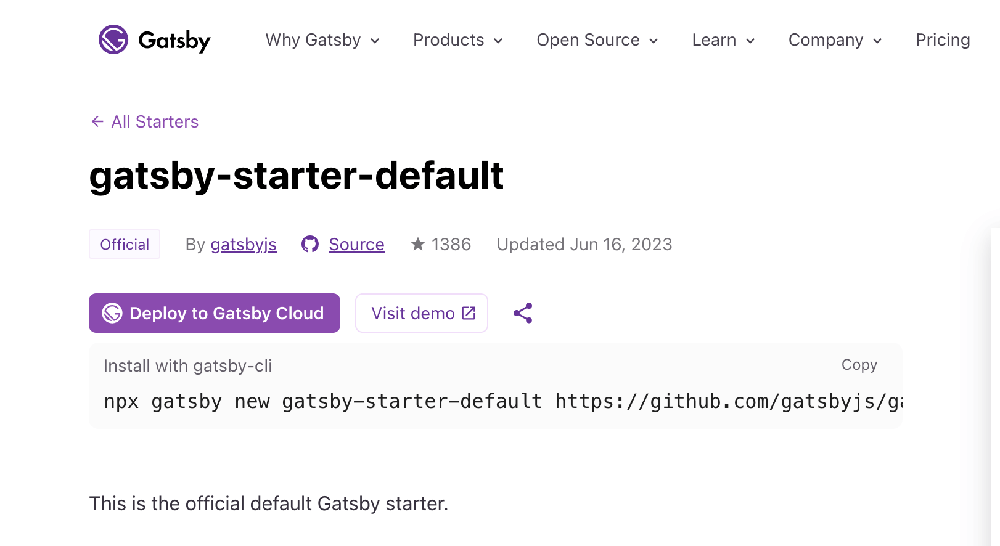
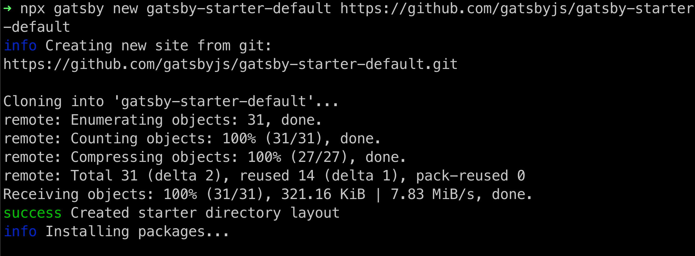
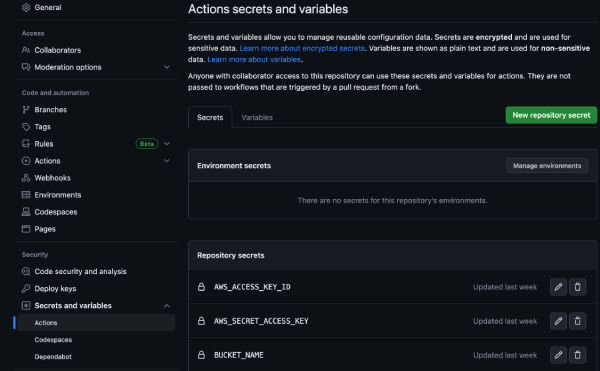

## How to deploy Gatsby on AWS

If you're anything like me then you've probably seen a lot of different [React](https://react.dev/) frameworks in your time. I recently moved my website from using [NextJs](https://nextjs.org/) over to using [Gatsby](https://www.gatsbyjs.com/). Now, I know that Gatsby have their own hosting Cloud, but, I use [AWS](https://aws.amazon.com/) and I can host a web application in AWS for a lot less $$$ there.

Alright, so today we are going to build and deploy a Gatsby website to AWS. The website will be copied to [S3](https://aws.amazon.com/s3/) and then we will have a [Cloudfront Distribution](https://aws.amazon.com/cloudfront/) in front of it. The process will be completely automated using [GitHub Actions](https://github.com/features/actions).

Before we continue please see the list of prerequisites below.

### Prerequisites

1. An [AWS free tier](https://aws.amazon.com/free/) account
2. A free [GitHub](https://github.com/) account
3. A free copy of [Visual Studio Code](https://code.visualstudio.com/)
4. Basic knowledge of your terminal or commandline

### Creating the project

Now we are going to get a copy of a Gatsby starter. Gatsby starters are small projects that allow you to get up and running with your Gatsby website very quickly. Gatsby have conviently grouped all of their [starters](https://www.gatsbyjs.com/starters/) in one [location](https://www.gatsbyjs.com/starters/). At this point, it does not matter which of the starters you choose to use.

I've chosen the default [Gatsby Starter](https://www.gatsbyjs.com/starters/gatsbyjs/gatsby-starter-default/) which is totally fine for this project.



Open up your terminal and copy the link to the starter into your terminal. Hit enter or return depending on your machine type.

You will see something like this below.



Once the Gatsby install has completed you will receive a message like the one below:

`Your new Gatsby site has been successfully bootstrapped. Start developing it by
running:`

`cd gatsby-starter-default`

`gatsby develop`

Run the commands above and the using your web browser navigate to the following link `http://localhost:8000`. You should now see your Gatsby website running on your local machine.

Exit out of that command to stop the website running.

Still in your command, window type the following `code .`, this command will open your visual studio code editor.

### Creating the workflow

Now, in the next step, we are going to create our Github Actions workflow.

first, lets create the `.github` folder

```bash
mkdir .github
```

we change into the folder

```bash
cd .github
```

and then we create a new folder inside the `.github` folder

```bash
mkdir workflows
```

next and still inside the workflows folder, lets create the github actions `yml` file.

```bash
touch ci.yml
```

Ok, now we are ready to copy the code below into our `ci.yml` file.

```yml
name: Deploy a Gatsby website

env:
  BUCKET_NAME: ${{ secrets.BUCKET_NAME }}

on:
  push:
    branches:
      - main
jobs:
  build:
    runs-on: ubuntu-latest
    timeout-minutes: 10
    steps:
      - uses: actions/checkout@v3
      - uses: actions/setup-node@v3
        with:
          node-version: 18
      - name: Caching Gatsby
        id: gatsby-cache-build
        uses: actions/cache@v3
        with:
          path: |
            public
            .cache
            node_modules
          key: ${{ runner.os }}-gatsby-starter-site-build-${{ github.run_id }}
          restore-keys: |
            ${{ runner.os }}-gatsby-starter-site-build-
      - name: Install dependencies
        run: yarn install
      - name: Run Lint
        run: yarn run lint
      - name: Build
        run: yarn run build
      - name: Set AWS credentials
        uses: aws-actions/configure-aws-credentials@v2
        with:
          aws-access-key-id: ${{ secrets.AWS_ACCESS_KEY_ID }}
          aws-secret-access-key: ${{ secrets.AWS_SECRET_ACCESS_KEY }}
          aws-region: ap-southeast-2
      - name: Deployment info
        shell: bash
        run: |
          make deploy
```

Just to run through the code briefly. The setting below will make sense once we start to setup our github secrets. These settings are needed for the deployment and cache invalidation (more on that later).

```yml
env:
  BUCKET_NAME: ${{ secrets.BUCKET_NAME }}
```

The lines below are basically what triggers the job to run. Its set for each [git push](https://docs.github.com/en/get-started/using-git/pushing-commits-to-a-remote-repository) to run on the [branch](https://docs.github.com/en/pull-requests/collaborating-with-pull-requests/proposing-changes-to-your-work-with-pull-requests/about-branches) name main.

```yml
on:
  push:
    branches:
      - main
```

The following lines are configuring the operating system, node version and caching of build assets.

```yml
jobs:
  build:
    runs-on: ubuntu-latest
    timeout-minutes: 10
    steps:
      - uses: actions/checkout@v3
      - uses: actions/setup-node@v3
        with:
          node-version: 18
      - name: Caching Gatsby
        id: gatsby-cache-build
        uses: actions/cache@v3
        with:
          path: |
            public
            .cache
            node_modules
          key: ${{ runner.os }}-gatsby-starter-site-build-${{ github.run_id }}
          restore-keys: |
            ${{ runner.os }}-gatsby-starter-site-build-
```

Lastly we have our steps where we install our dependencies, run our linting, build and deployment.

```yml
- name: Install dependencies
  run: yarn install
- name: Run Lint
  run: yarn run lint
- name: Build
  run: yarn run build
- name: Set AWS credentials
  uses: aws-actions/configure-aws-credentials@v2
  with:
    aws-access-key-id: ${{ secrets.AWS_ACCESS_KEY_ID }}
    aws-secret-access-key: ${{ secrets.AWS_SECRET_ACCESS_KEY }}
    aws-region: ap-southeast-2
- name: Deployment info
  shell: bash
  run: |
    make deploy
- name: Invalidate cache
  shell: bash
  run: |
    make invalidate
```

Ok so now we have the workflow ready to go we need to create the [Makefile](https://makefiletutorial.com/) and some make targets. We are only going to touch on the very basics of Makefiles, but I do encourage you to [read more about them](https://makefiletutorial.com/) as they are very useful.

### Create the Makefile

Open up your terminal / command line once again and then type the following in the root folder of your Gatsby project:

```bash
touch Makefile
```

Now go back into the `Visual Studio Code` editor and then copy the following code into the Makefile you just created.

```bash
SHELL=/bin/bash

deploy:
	echo "syncing bucket"
	aws s3 sync public/. s3://$(BUCKET_NAME)

invalidate:
	aws cloudfront create-invalidation \
    --distribution-id $(DISTRIBUTION_ID) \
    --paths "/*"
```

The file above is simple. It has two make targets one, that syncs the built Gatsby site to your s3 bucket, (more on this later) and another target that invalidates our Cloudfront cache.

Ok, so now we have our workflow and our Makefile ready to go. We need to create some secrets in our GitHub repository. These secrets will be used by our workflow to deploy our Gatsby website to AWS.

Before we proceed, ensure that you have [created your repository](https://docs.github.com/en/get-started/quickstart/create-a-repo) in GitHub and that you have pushed your code.

### Creating the AWS infrastructure

Moving on, now we need to create our user, policy and our bucket.

Go to the [AWS console](https://console.aws.amazon.com/) and then search for `S3` and then click on the `Create bucket` button. Give your bucket a name like `mybucket.com` and then click and ensure that `lock all public access` is not checked. Finish by clicking the `Create buvket` button.

Go to the [AWS console](https://console.aws.amazon.com/) and then click on the `IAM` and then click policies. Click on the `Create policy` button and then paste the code below into the `JSON` tab of the policy editor and paste thee code below into it. Give it a name like `S3AndCloufront` and then save it.

```json
{
  "Version": "2012-10-17",
  "Statement": [
    {
      "Sid": "GetBucketLocation",
      "Effect": "Allow",
      "Action": ["s3:GetBucketLocation"],
      "Resource": ["arn:aws:s3:::*"]
    },
    {
      "Sid": "BucketAccess",
      "Effect": "Allow",
      "Action": [
        "s3:PutBucketWebsite",
        "s3:PutObject",
        "s3:PutObjectAcl",
        "s3:GetObject",
        "s3:ListBucket",
        "s3:DeleteObject"
      ],
      "Resource": ["arn:aws:s3:::mybucket.com", "arn:aws:s3:::mybucket.com/*"]
    },
    {
      "Sid": "CloudfrontAccess",
      "Effect": "Allow",
      "Action": ["cloudfront:GetInvalidation", "cloudfront:CreateInvalidation"],
      "Resource": "*"
    }
  ]
}
```

Ok now, staying with IAM click on the `Users` link and then click on the `Add users` button. Give your user a name and then `Next` and now, under `Set Permissions` select the `Attach policies directly` option. Click next and you can give it some tags then click create user.

Now that you have create the user you will need to get the `Access key ID` and the `Secret access key`. Click on the user you just created and then click on the `Security credentials` tab. Click on the `Create access key` button and then select `Command Line Interface (CLI)`, click next and then set your description. Now click `Create access key`. You will need to save the access key information for use in the Github pipeline.

### Putting it altogether

Alright now lets put it altogether by creating our secrets in GitHub. Add your AWS keys and your bucket like the following.



Now make a small change to your project and then push the changes. On the gihub screen you under `Workflows` you should see the workflow running. Once the workflow has finished you should be able to browse the s3 bucket that you created and see your website `https://my-bucket.com.s3-website-ap-southeast-2.amazonaws.com/`
.

Stay tuned for the next post where we will add a Cloudfront distribution in front of our website.
