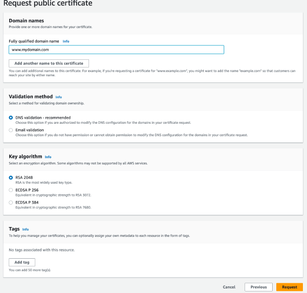

### How to set up Gatsby on AWS Cloudfront

This article is a [continuation of my last article](/blog/how-to-deploy-gatsby-on-aws/) where I took you through setting up Gatsby and deploying the Gatsby website to Amazon S3.

In this article we will go through the AWS console and setup our Cloudfront Distribution.

### Prerequisites

1. You have completed the previous article [How to deploy Gatsby on AWS](/blog/how-to-deploy-gatsby-on-aws/)

### What is Cloudfront?

Amazon CloudFront is a content delivery network (CDN) service built for high performance, security, and developer convenience. Cloudfront is a whole other article on it's own. I'll be touching on the basics here. I do encourage you to read up [on it](https://aws.amazon.com/cloudfront/).

Alright, logging into your AWS console, using the same account you used in the previous [article](/blog/how-to-deploy-gatsby-on-aws/). In the search box, at the top of the page search for `Cloudfront` and then click on the link to it.

You'll arrive on the Cloudfront dashboard. Click on the `Create Distribution` button.

On that screen you'll see `Origin domain`, from the drop down select the S3 bucket you created in the previous article. Then, enter a name for the Distribution.

### A quick visit to ACM (Amazon Certificate Manager)

Now scroll down and then on the `Settings` tab select `Custom SSL certificate` and then choose the `Request Certificate` link just underneath the dropdown.

At this point you have been taken to the AWS [Certificate Manager](https://aws.amazon.com/certificate-manager/) (ACM). Use AWS Certificate Manager (ACM) to provision, manage, and deploy public and private SSL/TLS certificates for use with AWS services and your internal connected resources. ACM removes the time-consuming manual process of purchasing, uploading, and renewing SSL/TLS certificates. Besides the automatic renewal that is managed by AWS, its free....

Lets get back to it.

Under the heading `Request certificate` select `Request a public certificate` and then click the `Next` button.

You'll see a screen like the one below. Fill out the fields as per the screen and then click 'Request` button.



Once you have clicked the `Request` button you'll be taken to a screen that has a list of certificates. You will see your certificate in that list then, underneath the `Status` column, you will see the `Pending validation` status just under the `Certificate ID` column. Your certificate with show as a link. Click the link, and on the `Certificate status` screen you will see another headling labelled `Domains (1)`. At this point, we need to validate our certificates. There is a button underneath the `Domains (1)` that says `Create records in Route 53`. Click that button and follow the prompts.

If the certificate validation is successful you will see a screen like the one below.


Now, go back to the Cloudfront tab and refresh the page. You should now see your certificate in the dropdown. Select it and then scroll (and ensure your data is still present) down and click the `Create Distribution` button.

At this point you will need to wait a little while for the distribution to be created.

Once the distribution has been created you can access it via the cloudfront console, clicking on the `Domain name` (123456789.cloudfront.net) will take you to your already deployed Gatsby website. Go back and copy the Distribution ID, we will need it later.

### Finishing touches

Okay, so we have our Gatsby website deployed to S3 and we have our Cloudfront distribution setup and we can access it via a web browser.

We need to modify our build. Lets go back to file that we used for our GitHub actions work flow.

Now, we need to ID of your newly created Cloudfront distribution to create a new secret in Github. If you have forgotten how to do this then head over to the previous article [How to deploy Gatsby on AWS](/blog/how-to-deploy-gatsby-on-aws/).

Then in the file below add a new value under env ` DISTRIBUTION_ID: ${{ secrets.DISTRIBUTION_ID }}`.

Lastly, lets add a new Makefile target to invalidate the Cloudfront cache. So what does this actually do? Cloudfront caches all of your content for fast delivery. When you invalidate the Cloudfront cache, you are telling Cloudfront to clear the cache and get the latest version of your website. This is useful when you have made changes to your website and you want to see them immediately.

```Makefile
- name: Invalidate cache
  shell: bash
  run: |
    make invalidate
```

Now add the code above to the end of the file below.

```yml
name: Deploy a Gatsby website

env:
  BUCKET_NAME: ${{ secrets.BUCKET_NAME }}
  DISTRIBUTION_ID: ${{ secrets.DISTRIBUTION_ID }}

on:
  push:
    branches:
      - main
jobs:
  build:
    runs-on: ubuntu-latest
    timeout-minutes: 10
    steps:
      - uses: actions/checkout@v3
      - uses: actions/setup-node@v3
        with:
          node-version: 18
      - name: Caching Gatsby
        id: gatsby-cache-build
        uses: actions/cache@v3
        with:
          path: |
            public
            .cache
            node_modules
          key: ${{ runner.os }}-gatsby-starter-site-build-${{ github.run_id }}
          restore-keys: |
            ${{ runner.os }}-gatsby-starter-site-build-
      - name: Install dependencies
        run: yarn install
      - name: Run Lint
        run: yarn run lint
      - name: Build
        run: yarn run build
      - name: Set AWS credentials
        uses: aws-actions/configure-aws-credentials@v2
        with:
          aws-access-key-id: ${{ secrets.AWS_ACCESS_KEY_ID }}
          aws-secret-access-key: ${{ secrets.AWS_SECRET_ACCESS_KEY }}
          aws-region: ap-southeast-2
      - name: Deployment info
        shell: bash
        run: |
          make deploy
      - name: Invalidate cache
        shell: bash
        run: |
          make invalidate
```

Thats it. Now you can push your changes to GitHub and watch your website deploy.

I hope you enjoyed this article. Stay tuned for the new article, where I will add some rewriting to the Cloudfront distribution, to handle all of the pages that appear under the root of the website.
