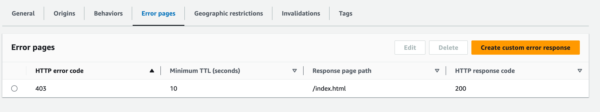
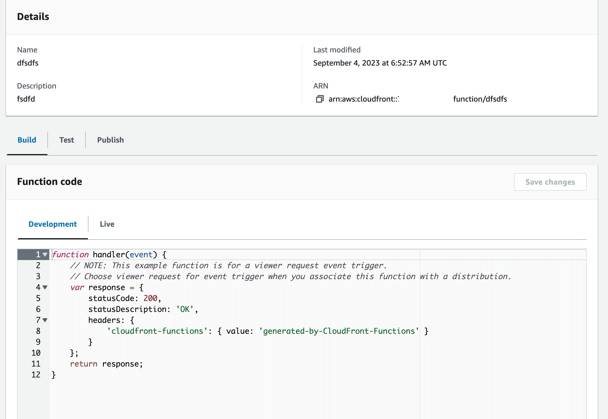

# How to configure the Gatsby redirect on AWS Cloudfront

This article is a continuation of my last 2 articles [How to deploy Gatsby on AWS](/blog/how-to-deploy-gatsby-on-aws/) and [How to set up Gatsby on AWS Cloudfront](/blog/setup-gatsby-on-aws-cloudfront/) .

In this article we will go through the AWS console and setup our Cloudfront redirects. The redirects are important to ensure that Cloudfront sends the user to the correct page.

### Prerequisites

1. You have read the previous two articles and completed the setup.

Ok lets get started. First we need to go to the AWS console and select Cloudfront. In the top left corner of the page underneath the aws logo click the three horizontal lines to expand the menu (if its closed).

If the menu is open then just click Distributions. On the Distributions screen you should see your distribution that you created in the previous article. Click on the ID of the distribution to open the distribution details. Under the distribution click on `Error pages` tab and then click `Create custom error response`.

From the `HTTP error code` dropdown select `403: Forbidden`, next under `Error caching minimum TTL` leave the value as 10. Next, under `Customize error response` select `Yes` then, for the value `Response page path` type in `/index.html` and for the value `HTTP Response Code` select `200: OK` from the dropdown. Finally click `Create`.

You should now see something like below.



Ok, now we are half way there. Next go back to your Cloudfront homepage and then select `Functions`, Create function. For the function name, type in `redirects` and then for the description type in `Gatsby redirects`.

You will now be presented a screen that has some code and a few tabs. It will looks like the screen below.



The first thing we need to do is click the `Build` tab and then under `Function code` replace the code with the code below.

````js

```js
function handler(event) {
  var request = event.request;
  var uri = request.uri;

  var domainUri = request.uri.split('/');

  // Check whether the URI is missing a file name.
  if (uri.endsWith('/')) {
    request.uri += 'index.html';
  }
  // Check whether the URI is missing a file extension.
  else if (!uri.includes('.')) {
    request.uri += '/index.html';
  }

  return request;
}
````

Now click the `Save changes` button. Now that you have saved the function you need to assciate the function with your cloudfront distribution. Select the `Publish` tab and then scroll down to `Associated distributions` and then click the button `Add associations`. A popup will appear, there are 3 dropdowns.

In the first dropdown select your distribution id, the second dropdown `Event type` should have `Viewer request` selected and lastly, the `Cache behaviour` should have `Default(*)` selected. Once these settings have been chosen click the `Add association` button.

Okay, the final step. Under the heading `Publish` click the `Publish` button. You will need to wait about 10 minutes for the Cloudfront distribution to deploy.

Now go back to your Cloudfront Distribution's URL e.g `https://123d36drzkt1o9ee4.cloudfront.net`, you should now be able to navigate to any page on your site and the page will load and show you the content.
