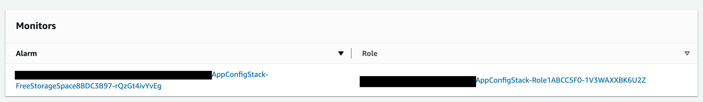
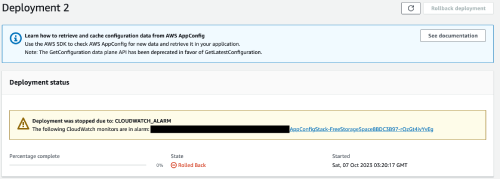

# Monitoring your App Config

As we discorved in the [previous article](/blog/what-is-aws-app-config/). AWS App Config can be used to create, manage, and quickly deploy application configurations. One of the best features of AWS App Config is the monitoring. When we are talking about monitoring, we are talking about attaching the deployment of the configuration to an actual Cloudwatch Alarm.

Picture this scenario, you're rolling out some new functionality, toggling new feature and then the applications starts to have failures. What do you do then? With AWS App Config monitoring, if there's an error whilst the deployment is happening, the deployment will roll back without human intervention.

### Prerequisites

1. All the setup of the [previous article](/blog/what-is-aws-app-config/)
2. AWS cli installed on [your machine](https://docs.aws.amazon.com/cli/latest/userguide/getting-started-install.html)
3. A deployed stack with your AWS App Config, you can run this command to check: `aws cloudformation list-stacks --stack-status-filter CREATE_COMPLETE`

If you want to follow along with the code, you can find it [here](https://github.com/seanrkerr/personal-blog/tree/main/app-config-monitoring).

### Creating the alarm

First, we are going to create a Cloudwatch alarm. The alarm we are creating is going to be stand alone alarm, and we are going to trigger it via an AWS CLI command.

Ok, lets create the alarm, open up the file `app-config-stack.ts` and paste that code under the `app` declaration.

```typescript
const alarm = new cw.Alarm(this, 'FakeAlarm', {
  metric: new cw.Metric({
    metricName: 'FakeAlarmMetric',
    namespace: 'AWS/RDS',
    period: Duration.minutes(1),
    unit: cw.Unit.COUNT,
    statistic: cw.Stats.SUM,
    dimensionsMap: {
      DBInstanceIdentifier: 'RDS-Fake',
    },
  }),
  threshold: 90,
  evaluationPeriods: 1,
});
```

### Creating the role

Now we need to create a role. The [role principle](https://docs.aws.amazon.com/IAM/latest/UserGuide/intro-structure.html) is `appconfig.amazonaws.com`. I encourage you to read more about [IAM](https://docs.aws.amazon.com/IAM/latest/UserGuide/intro-structure.html).

Copy the code below just under the alarm you just created.

```typescript
const role = new iam.Role(this, 'Role', {
  assumedBy: new iam.ServicePrincipal('appconfig.amazonaws.com'),
  description: 'Example role...',
});
```

### Creating the policy

Now lets create the policy, which will allow the AWS App Config to describe the Cloudwatch alarm we are about to create.

```typescript
role.addToPolicy(
  new iam.PolicyStatement({
    effect: iam.Effect.ALLOW,
    actions: ['cloudwatch:DescribeAlarms'],
    resources: [alarm.alarmArn],
  }),
);
```

### Adding the monitor

Lastly, we need to modify our environment class to add the monitors property in.

Lets open up the file `APEnvironment.ts` and then replace all of the code with the code below.

```typescript
import { aws_appconfig as appconfig } from 'aws-cdk-lib';
import { Construct } from 'constructs';

export type APEnvironmentProps = {
  appId: appconfig.CfnApplication;
  env: string;
  alarmArn: string;
  alarmRoleArn: string;
};

export default class APEnvironment extends appconfig.CfnEnvironment {
  constructor(scope: Construct, props: APEnvironmentProps) {
    super(scope, 'APEnvironment', {
      applicationId: props.appId.ref,
      name: props.env,
      monitors: [
        {
          alarmArn: props.alarmArn,
          alarmRoleArn: props.alarmRoleArn,
        },
      ],
    });
  }
}
```

Now in the file `app-config-stack.ts` you'll need to replace the initalisation of the environment with the code below:

```typescript
const env = new APEnvironment(this, {
  appId: this.app,
  env: 'My Cool Env',
  alarmArn: alarm.alarmArn,
  alarmRoleArn: role.roleArn,
});
```

Now lets deploy the stack with our changes:

```bash
cdk deploy
```

Once we deploy our stack, lets verify the alarm has been created also.

We can check it using this command:

```bash
aws cloudwatch describe-alarms
```

If that command was successfull then you should see some output like this:

```json
{
    "MetricAlarms": [
        {
            "AlarmName": "App-Config-Alarm",
            "AlarmArn": "arn:aws:cloudwatch:xxxxx:xxx:alarm:App-Config-Alarm",
            "AlarmDescription": "The default example alarm",
            "AlarmConfigurationUpdatedTimestamp": "2023-10-07T00:56:43.842000+00:00",
            "ActionsEnabled": true,
            "OKActions": [],
            "AlarmActions": [],
            "InsufficientDataActions": [],
            "StateValue": "INSUFFICIENT_DATA",
            "StateReason": "Unchecked: Initial alarm creation",
            "StateUpdatedTimestamp": "2023-10-07T00:56:43.842000+00:00",

            .... removed for brevity
```

### Testing the monitoring

So now we have deployed our new stack with our `Cloudwatch Alarm`, `IAM Role`, `IAM Policy`. Lets verify that our AWS App Config has the monitor listed in the AWS App Config Environment.

You should see your monitors that you created:



Ok now, lets do a test and see the roll back. Follow the steps below:

1. Login to your account and select `AWS Systems Manager` and then `AppConfig`

1. In click on `AppConfig` screen select the Environment that you created. Now switch back to your command window.

1. Next we need to trigger the alarm. We can run the command `aws cloudwatch set-alarm-state --alarm-name "AppConfigStack-xxxx" --state-value ALARM --state-reason "testing purposes"`, ensuring that you're triggering the alarm you `described` earlier. Now switch back to the AWS console.

1. On the right of the screen, you will see a button labelled `Start Deployment'. Click that button and fill out the fields. Once the deployment starts it will detect that there is an error and start to rollback.

The message will look similar to the one below. This is one of the more powerful features that AWS App Config offers.



I hope that you enjoyed the AWS App Config Monitoring article. If you want to have a look through the code then you can [get it here](https://github.com/seanrkerr/personal-blog/tree/main/app-config-monitoring).

Stay tuned for the next article!
